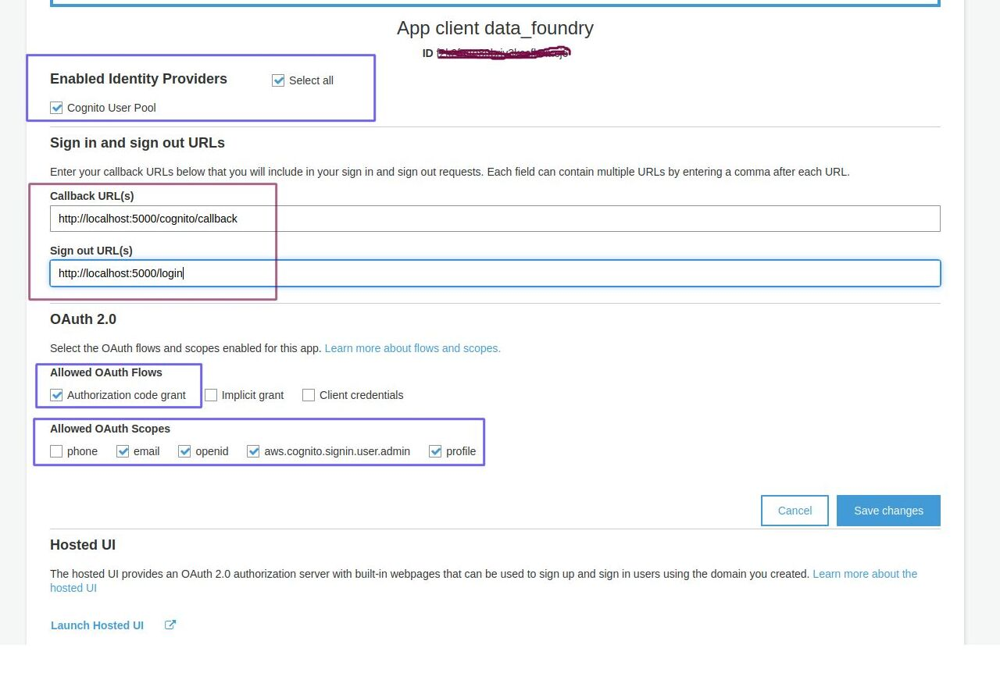

# Flask-Cognito-Auth

[](https://opensource.org/licenses/MIT)
[](https://github.com/ankit-shrivastava/flask-cognito-auth/blob/main/htmlcov/index.html)

Flask-Cognito-Auth is a Flask implementation of AWS Cognito Service with User Pool. This extension helps to implement authentication solutions based on AWS's Cognito Service. It contains helpful functions and properties to handle oauth2 and token based authentication flows.
This extension requires to enable "Enabled Identity Providers" in Appllication client settings of User Pool within AWS Cognito Sevice.




```bash
pip install flask-cognito-auth
```

### Usage

```python
from flask import Flask
from flask import redirect
from flask import url_for
from flask import session
from flask import jsonify
from flask_cognito_auth import CognitoAuthManager
from flask_cognito_auth import login_handler
from flask_cognito_auth import logout_handler
from flask_cognito_auth import callback_handler

app = Flask(__name__)
app.secret_key = "my super secret key"

# Setup the flask-cognito-auth extention
app.config['COGNITO_REGION'] = "us-east-1"
app.config['COGNITO_USER_POOL_ID'] = "us-east-1_xxxxxxx"
app.config['COGNITO_CLIENT_ID'] = "xxxxxxxxxxxxxxxxxxxxxxxxxx"
app.config['COGNITO_CLIENT_SECRET'] = "xxxxxxxxxxxxxxxxxxxxxxxxxx"
app.config['COGNITO_DOMAIN'] = "https://yourdomainhere.com"
app.config["ERROR_REDIRECT_URI"] = "page500"        # Optional

app.config['COGNITO_REDIRECT_URI'] = "https://yourdomainhere/cognito/callback"  # Specify this url in Callback URLs section of Appllication client settings of User Pool within AWS Cognito Sevice. Post login application will redirect to this URL

app.config['COGNITO_SIGNOUT_URI'] = "https://yourdomainhere/login" # Specify this url in Sign out URLs section of Appllication client settings of User Pool within AWS Cognito Sevice. Post logout application will redirect to this URL


cognito = CognitoAuthManager(app)
# cognito = CognitoManager(app)
# cognito.init(app)


@app.route('/login', methods=['GET'])
def login():
    print("Do the stuff before login to AWS Cognito Service")
    response = redirect(url_for("cognitologin"))
    return response


@app.route('/logout', methods=['GET'])
def logout():
    print("Do the stuff before logout from AWS Cognito Service")
    response = redirect(url_for("cognitologout"))
    return response


# Use @login_handler decorator on cognito login route
@app.route('/cognito/login', methods=['GET'])
@login_handler
def cognitologin():
    pass


@app.route('/home', methods=['GET'])
def home():
    current_user = session["username"]
    return jsonify(logged_in_as=current_user), 200


# Use @callback_handler decorator on your cognito callback route
@app.route('/cognito/callback', methods=['GET'])
@callback_handler
def callback():
    print("Do the stuff before post successfull login to AWS Cognito Service")
    for key in list(session.keys()):
        print(f"Value for {key} is {session[key]}")
    response = redirect(url_for("home"))
    return response


# Use @logout_handler decorator on your cognito logout route
@app.route('/cognito/logout', methods=['GET'])
@logout_handler
def cognitologout():
    pass


@app.route('/page500', methods=['GET'])
def page500():
    return jsonify(Error="Something went wrong"), 500


if __name__ == '__main__':
    app.run(debug=True)
```


### Development Setup

Using pipenv
```bash
pipenv install --dev 
```
Using virtualenv
```bash
python3 -m venv env
source env/bin/activate
pip install .
```

### Contributing

1. Fork repo- https://github.com/ankit-shrivastava/flask-cognito-auth.git
2. Create your feature branch - `git checkout -b feature/name`
3. Add Python test (pytest) and html covrage report for added   feature.
4. Commit your changes - `git commit -am "Added name"`
5. Push to the branch - `git push origin feature/name`
6. Create a new pull request
